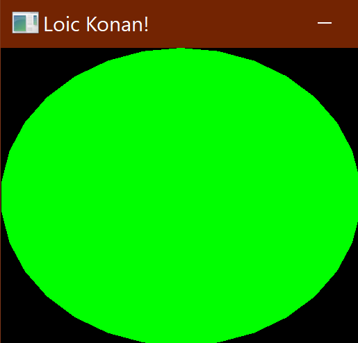

## SFML Intro

### Loic Konan

### Description

This is the "hello world" of SFML game programming.
This assignment is more about breaking the ice with SFML, and how to get comfortable with it for future programs.

### Files

|  #  | File                             | Description                       |
| :-: | -------------------------------- | --------------------------------- |
|  1  | [main.cpp](main.cpp)             | The main cpp saying "Hello World" |
|  2  | [screenshot.png](screenshot.png) | The Screen shot of the green dot  |
|  3  | [Banner](Banner)                 | Banner for Assignment             |

### Instructions

This program does not require any non standard libraries.

### Example

  
