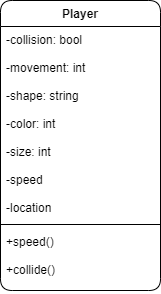
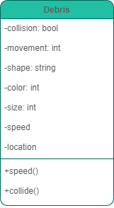
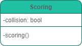
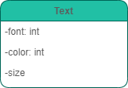
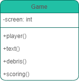
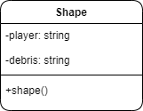
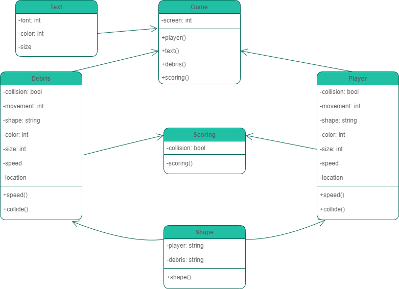

## Assignment 7 - Designing The Game

### Loic Konan

#### Description

To use **Object Oriented Programming** mindset to clarify what we need to implement, what classes are needed, how those classes are related and finally to specifies how they will carry out their resposibilities.

### Files

|  #  | File                       | Description                           |
| :-: | -------------------------- | ------------------------------------- |
|  1  | [Banner](Banner)           | Banner for Assignment                 |
|  1  | [Diagram.png](Diagram.png) | Visual model of the classes using UML |

### Instructions

1. **Identify the classes and objects to be used in the program.**
2. **Define the attributes for each class.**
3. **Define the behaviors for each class.**
4. **Define the relationship between classes.**

### Possible Classes

**Player**

- Has a Shape
- Has a Size
- Has a Color
- Has a Speed
- Has a Location (could change)
- Can move in any direction using keys
- Can collide with other "objects"

**Debris**

- Has a Shape
- Has a Size
- Has a Color
- Has a Speed
- Has a Location (could change)
- Can move in any direction
- Can collide with other "objects"

**Scoring**

- When a Player comes collides with Debris score is negatively effected.
- When a piece of Debris leaves game screen (on the left), score is positively effected.
  

**Text**

- Has a Font (can change)
- Has a Location
- Has a Color
- Has a Size
  

**Game**

- Has player(s)
- Has score(s)
- Has debris(s) (yes "debris" can be plural but it doesn't make the point)
  

**Shape**

- Is a player
- Is a debris
  

### Diagram

