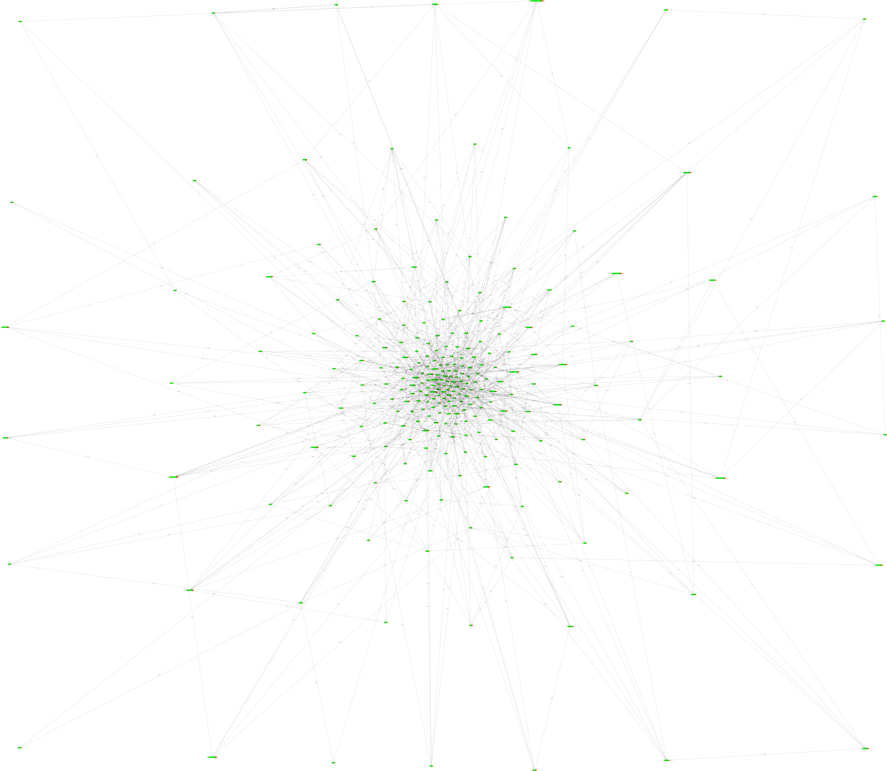

## Program 2 - Graphviz Class

### Loic Konan

#### Description

This Program is about implementing a **graphviz Language "wrapper"**.
This means we will be implementing a (tiny) **subset** of the graphviz language capability so we can visualize some of the typical data structures that will show all the countries of the world with a distance needed to travel to or from each other.

|   #   | File                                 | Description                                              |
| :---: | ------------------------------------ | -------------------------------------------------------- |
|   1   | [main.cpp](main.cpp)                 | The main driver.                                         |
|   2   | [input.txt](input.txt)               | The input file with all the countries names.             |
|   3   | [output.txt](output.txt)             | the output file of the design.                           |
|   4   | [Banner](Banner)                     | Banner for Assignment.                                   |
|   5   | [graphviz.svg](graphviz.svg)         | Will display the picture produce by the graphviz program |
|   6   | [GraphVizCode.dot](GraphVizCode.dot) | The code to paste in the graphviz website.               |

### Instructions

- Enter these file name below.
  - $ ./main.cpp
  - $ ./input.txt
  - $ ./output.txt

- Copy and Paste This Code into GraphViz
  - [GraphVizCode.dot](GraphVizCode.dot)

